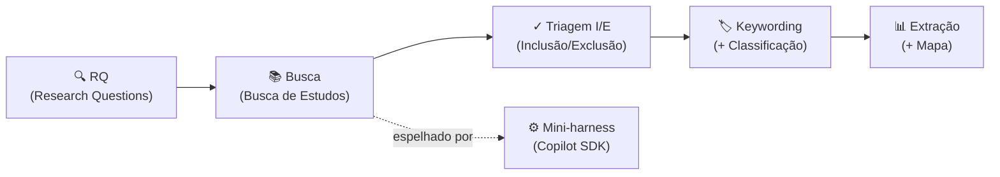

# Arquitetura do Mini-Harness (Copilot SDK) — Ferramenta de Triagem Bibliográfica

> **Objetivo da ferramenta:** ler os artigos baixados sobre *harness engineering* e correlatos, classificar cada um por critérios de viabilidade, e gerar uma tabela que ajude a **escolher o tema do TCC**. \*\***Importante:** esta ferramenta NÃO é o TCC — é o instrumento pessoal de descoberta que antecede o TCC. Como não faz parte da metodologia do TCC, pode usar o Copilot / Copilot SDK à vontade, sem exigências de documentação/validação formais.

---

## Ancoragem metodológica

As duas arquiteturas espelham o pipeline canônico de revisão bibliográfica.

**5 fases do Mapeamento Sistemático (Petersen et al., 2008; 2015):**

1. Definição das Research Questions (RQ)
2. Busca de estudos primários
3. Triagem por inclusão/exclusão (screening)
4. Keywording de abstracts + esquema de classificação
5. Extração de dados e mapeamento

**Kitchenham & Charters (2007)** acrescenta: protocolo, critérios I/E explícitos, quality assessment e síntese.

```
Pipeline canônico (Petersen/Kitchenham)
RQ -> Busca -> Triagem I/E -> Keywording + classificação -> Extração + mapa
      |
      espelhado por
      v
Mini-harness (Copilot SDK)
```



A diferença entre as duas opções é **quanta inteligência é delegada ao LLM**vs. **quanto se mantém determinístico (em código)**.

---

## OPÇÃO A — Pipeline Sequencial (determinístico + LLM por etapa)

Cada etapa canônica vira uma função/estágio isolado. O LLM é chamado como um "trabalhador" pontual, com prompt fixo e saída em JSON. Você controla o fluxo em código; o LLM só classifica.

Fluxo:

```
Loader (lê PDFs/BibTeX)
  -> Estágio 1: Dedup (código, sem LLM)
  -> Estágio 2: Triagem I/E (LLM: relevante? S/N + motivo)
  -> Estágio 3: Extração (LLM preenche formulário JSON)
  -> Estágio 4: Scoring viabilidade (código, regras)
  -> Writer (tabela.csv + relatorio.md)
```

Componentes:

| Componente | Responsabilidade | LLM? |
| --- | --- | --- |
| Loader | Lê PDFs/.bib, extrai texto (título, resumo, método) | Não |
| Dedup | Remove duplicados por DOI/título | Não |
| Triagem I/E | "Atende critérios de inclusão? S/N + trecho" | Sim |
| Extração | Preenche formulário estruturado (JSON abaixo) | Sim |
| Scoring | Calcula score de viabilidade por regras sobre o JSON | Não |
| Writer | Gera tabela.csv e relatorio.md ordenados por viabilidade | Não |

- Vantagens: simples de construir e depurar, barato, reprodutível, fácil de explicar.
- Desvantagens: menos "inteligente"; não lida bem com artigos ambíguos; sem keywording temático automático.
- Ancoragem: Loader/Dedup = Search; Triagem = Screening; Extração = Data extraction; Scoring/Writer = Mapping (Petersen fases 2-&gt;5).

---

## OPÇÃO B — Agente Orquestrador com ferramentas (agentic, mais poderoso)

Um agente central (padrão Planner-Generator-Evaluator) decide dinamicamente o que fazer com cada artigo, chamando tools registradas no Copilot SDK. Inclui etapa de keywording/clustering temático e um Evaluator que confere as próprias classificações.

Fluxo:

```
Orquestrador (Planner) — decide o próximo passo por artigo
  -> tool: extract_text(pdf)
  -> tool: screen(artigo, criterios)
  -> tool: extract_fields(artigo) -> JSON
  -> tool: extract_keywords(artigo)
  -> tool: score_feasibility(json, hardware)
  -> Evaluator — confere consistência; flag "incerto -> revisar"
  -> tool: write_report() — tabela + mapa de co-ocorrência
```

Componentes adicionais (além dos da Opção A):

| Componente | Responsabilidade | LLM? |
| --- | --- | --- |
| Orquestrador (Planner) | Decide quais tools chamar por artigo; retenta se incerto | Sim |
| Keyword/Cluster tool | Extrai keywords e agrupa por tema (mapa de co-ocorrência) | Sim+código |
| Evaluator | Relê a classificação; marca "confiável" vs "revisar" | Sim |
| Human-in-the-loop gate | Lista para você os casos marcados como incertos | Não |

- Vantagens: faz o mapa de co-ocorrência de keywords; lida com ambiguidade; auto-verificação; é a que mais parece "harness engineering de verdade".
- Desvantagens: mais complexa, mais chamadas ao LLM, mais difícil de depurar.
- Ancoragem: Evaluator = separação geração×avaliação (Anthropic; Kitchenham quality assessment); Keyword tool = fase 4 de Petersen (keywording of abstracts).

---

## Comparação e recomendação

| Critério | Opção A (Sequencial) | Opção B (Agente) |
| --- | --- | --- |
| Esforço de construção | Baixo | Médio-alto |
| Custo (chamadas LLM) | Baixo | Médio |
| Faz mapa de keywords | Não | Sim |
| Auto-verificação | Não | Sim (Evaluator) |
| Facilidade de depurar | Alta | Média |
| "Cara" de harness engineering | Baixa | Alta |

**Recomendação:** construir a Opção A primeiro (funciona em uma tarde, já entrega a tabela de viabilidade). Para o mapa de co-ocorrência e a auto-verificação, evoluir para a Opção B adicionando as duas tools extras (Keyword + Evaluator). A base sequencial vira as tools do agente — reaproveitamento total.

---

## Plano de implementação (comum às duas, com Copilot SDK)

**Fase 0 — Preparação (1/2 dia)**

1. Definir critérios de inclusão/exclusão e o critério de "viável" (depende do hardware).
2. Baixar 20–40 PDFs relevantes numa pasta.

**Fase 1 — Núcleo (Opção A)**

1. Loader: extrair texto dos PDFs (pypdf/pdfplumber).
2. Registrar no Copilot SDK um prompt de triagem e um prompt de extração (JSON abaixo).
3. Loop sobre os artigos -&gt; salvar cada JSON.
4. score_feasibility em código puro (regras).
5. Writer -&gt; tabela.csv + relatorio.md.

**Fase 2 — Evolução (Opção B, opcional**)6. Envolver os prompts como tools do agente. 7. Adicionar extract_keywords + contagem de co-ocorrência (matriz -&gt; exportável p/ VOSviewer). 8. Adicionar Evaluator + lista de "revisar manualmente".

---

## Formulário de extração (o "contrato" do harness — saída JSON por artigo)

```json
{
  "id": "string (DOI ou chave bibtex)",
  "titulo": "string",
  "ano": 0,
  "incluido": true,
  "motivo_triagem": "string curto",
  "tecnica_principal": "ex.: distillation | LLM-as-judge | tool-calling | RAG",
  "metodo_avaliacao": "ex.: exact-match | pass@k | rubrica | humano",
  "tamanho_modelo_B": "ex.: 3 | 7 | >=70 | nao-informado",
  "precisa_gpu_cara": "sim | nao | incerto",
  "reprodutivel_hardware_modesto": "sim | nao | incerto",
  "esforco_reproducao_estimado": "baixo | medio | alto",
  "keywords": ["...", "..."],
  "trecho_evidencia": "citação literal que embasa a classificação",
  "confianca": "alta | media | baixa"
}
```

O campo score_feasibility (código) combina tamanho_modelo_B, precisa_gpu_cara, reprodutivel_hardware_modesto e esforco_reproducao_estimado num ranking. Os artigos no topo são os candidatos a tema de TCC.

---

## Strings de busca (para popular a pasta de PDFs)

Bloco A – Harness/agente: "harness engineering", "agent harness", "LLM harness", "evaluation harness", "agentic AI", "LLM agent", "tool-use"/"tool calling", "planner generator evaluator", "LLM-as-judge", "agent evaluation"

Bloco B – Modelos pequenos: "small language model\*", SLM, "on-device", "edge LLM", "efficient inference", "quantization"/"quantized", "knowledge distillation", "parameter-efficient", LoRA, "sub-billion", "7B"/"3B"/"1B"

Bloco C – Avaliação simples: "benchmark", "pass@k", "exact match", "rubric", "automatic evaluation", "reproducib\*", "low-cost evaluation", "lightweight evaluation"

Bloco D – Revisão/mapeamento: "systematic literature review", "systematic mapping", "survey", "scoping review", "bibliometric"

String-exemplo: ("small language model\*" OR "SLM" OR "on-device" OR "edge LLM") AND ("agent\*" OR "harness" OR "tool-use" OR "tool calling" OR "LLM-as-judge") AND ("evaluation" OR "benchmark" OR "reproducib\*")

Bases: CAFe/Portal CAPES, Scopus, IEEE Xplore, ACM DL, ACL Anthology, arXiv.

---

## Referências metodológicas (para citar, se justificar a ferramenta)

- Petersen, K. et al. (2008). Systematic Mapping Studies in Software Engineering. EASE.
- Petersen, K. et al. (2015). Guidelines for conducting systematic mapping studies in software engineering: An update. Information and Software Technology.
- Kitchenham, B.; Charters, S. (2007). Guidelines for performing Systematic Literature Reviews in Software Engineering. EBSE Technical Report.
- Wohlin, C. (2014). Guidelines for snowballing in systematic literature studies. EASE.

## Próximas decisões para detalhar a implementação

1. Que hardware você tem? (define as regras de score_feasibility)
2. Opção A ou já quer a B?
3. Escrever o esqueleto de código (estrutura de arquivos + prompts prontos
4. 