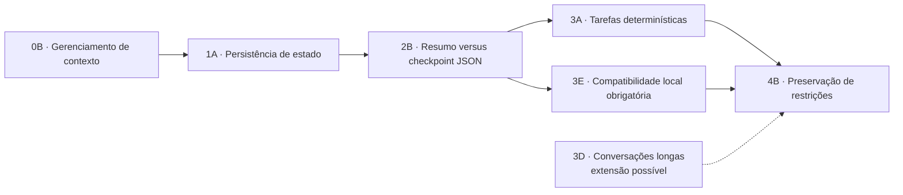

---
aliases:
  - Seleção de granularidade
tags:
  - tcc
  - delimitacao
  - granularidade
status: preliminar
---

# Seleção do recorte

Foram mantidas 7 opções. Os níveis 0 e 1 definem a base do tema; o nível 2 apresenta uma comparação experimental; o nível 3 apresenta escolhas de contexto; o nível 4 contém a formulação final escolhida.

| Nível | Opção escolhida | Descrição expandida | Pergunta correspondente |
| --- | --- | --- | --- |
| 0 — Área ampla | [[01-base-conceitual#0B — Gerenciamento de contexto\|0B · Gerenciamento de contexto]] | Examina como o conteúdo disponível ao modelo é selecionado, reduzido e organizado dentro de uma janela limitada. Inclui histórico, recuperação, sumarização e estruturas externas de contexto. | Como o gerenciamento de contexto influencia o desempenho de agentes baseados em modelos de linguagem? |
| 1 — Fenômeno | [[01-base-conceitual#1A — Persistência de estado\|1A · Persistência de estado]] | Focaliza a conservação explícita do estado operacional entre as etapas de uma tarefa, incluindo fatos coletados, decisões tomadas, restrições vigentes e ações já executadas. | Em que medida diferentes estratégias de persistência de estado afetam a confiabilidade e a eficiência de um agente baseado em SLM? |
| 2 — Comparação | [[02-comparacoes#2B — Resumo versus checkpoint JSON\|2B · Resumo × checkpoint JSON]] | Isola o efeito da representação do estado: texto livre produzido por sumarização versus campos explícitos e verificáveis em uma estrutura JSON. | Checkpoints JSON preservam melhor o estado da tarefa do que resumos textuais? |
| 3 — Contexto | [[03-contextos-de-avaliacao#3A — Tarefas sintéticas e determinísticas\|3A · Tarefas determinísticas]] | Emprega tarefas artificiais com estados finais, restrições e pontos de interrupção definidos previamente. Essa escolha permite avaliação automática, repetição controlada e análise causal. | Como as estratégias se comportam em tarefas cujo estado final e restrições podem ser verificados automaticamente? |
| 3 — Contexto | [[03-contextos-de-avaliacao#3D — Conversações longas\|3D · Conversações longas]] | Distribui fatos e preferências por uma conversa extensa para avaliar recuperação temporal e manutenção de coerência. Aproxima o estudo de benchmarks de memória conversacional. | Qual estratégia recupera melhor informações relevantes distribuídas ao longo de uma interação extensa? |
| 3 — Contexto obrigatório | [[03-contextos-de-avaliacao#3E — Execução local com SLM de 1–4B\|3E · Execução local 1–4B]] | Impõe compatibilidade com SLMs abertos, quantizados e executados em hardware de consumo. Inclui modelos Transformer, Griffin e SSM previamente selecionados, tornando tokens, latência, RAM e VRAM parte relevante da análise. | Qual estratégia oferece melhor equilíbrio entre confiabilidade e custo computacional em um SLM executado localmente? |
| 4 — Candidato final | [[04-candidatos-finais#4B — Preservação de restrições\|4B · Preservação de restrições]] | Recorte centrado na comparação entre sumarização textual e checkpoint JSON, com foco na preservação de restrições em tarefas determinísticas. | Em SLMs locais, checkpoints JSON reduzem a perda de restrições quando comparados à sumarização textual? |

## Diagrama do recorte

## Síntese do tema atual

O tema investiga como mecanismos externos de gerenciamento de contexto preservam o [[05-glossario#Estado operacional|estado operacional]] de agentes baseados em [[05-glossario#SLM|SLMs]] locais. A avaliação deverá observar interrupção e retomada de tarefas, correção do estado, preservação de restrições e custo computacional.

## Decisão que ainda falta

O candidato final escolhido é **4B — Preservação de restrições**. O estudo compara sumarização textual e checkpoint JSON em tarefas determinísticas executadas por um SLM local.

Consulte [[04-candidatos-finais#4B — Preservação de restrições]].

