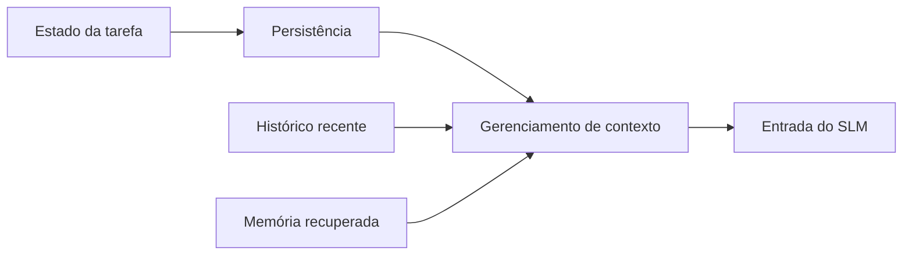

---
tags:
  - tcc
  - contexto
  - estado
---

# Base conceitual

## 0B — Gerenciamento de contexto

Gerenciamento de contexto é o conjunto de mecanismos que decide **quais informações serão apresentadas ao modelo em cada chamada**. O modelo não acessa automaticamente todo o histórico ou o estado do ambiente; o harness seleciona e organiza esse conteúdo.

Pode envolver:

- histórico completo da interação;
- janela das mensagens mais recentes;
- sumarização de interações anteriores;
- recuperação de trechos relevantes;
- estado estruturado externo;
- combinação de estado estruturado e histórico recente.

O conceito é mais amplo do que memória. A memória representa informação preservada; o gerenciamento de contexto determina quando e como essa informação será reinserida na entrada do modelo.

Pergunta associada:

> Como o gerenciamento de contexto influencia o desempenho de agentes baseados em modelos de linguagem?

Termos relacionados: [[05-glossario#Janela de contexto]], [[05-glossario#Harness]], [[05-glossario#Memória externa]].

## 1A — Persistência de estado

Persistência de estado é a capacidade de registrar informações operacionais de uma tarefa de forma que elas permaneçam disponíveis entre passos, chamadas ou sessões.

O estado pode incluir:

- objetivo atual;
- fatos já coletados;
- parâmetros fornecidos pelo usuário;
- restrições que não podem ser violadas;
- decisões confirmadas;
- ações e ferramentas já executadas;
- resultados intermediários;
- próximo passo esperado.

Persistência não significa apenas lembrar uma conversa. Uma conversa pode conter informações relevantes, irrelevantes e contraditórias. O estado operacional busca representar somente aquilo que é necessário para continuar a tarefa corretamente.

Pergunta associada:

> Em que medida diferentes estratégias de persistência de estado afetam a confiabilidade e a eficiência de um agente baseado em SLM?

Termos relacionados: [[05-glossario#Estado operacional]], [[05-glossario#Checkpoint JSON]], [[05-glossario#Retomada]].

## Relação entre os dois conceitos

O gerenciamento de contexto é o mecanismo geral. A persistência de estado é uma função específica dentro dele.

