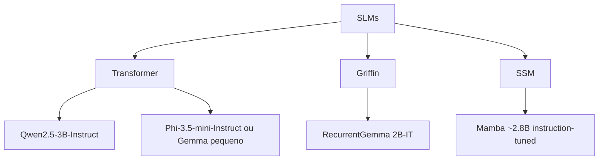

---
tags:
  - tcc
  - tarefas
  - avaliacao
---

# Contextos de avaliação selecionados

## 3A — Tarefas sintéticas e determinísticas

São tarefas criadas especificamente para o experimento, com entrada, regras, restrições, pontos de interrupção e estado final esperado definidos previamente.

### Exemplo

Um agente deve montar uma solicitação com campos obrigatórios, respeitar um limite de orçamento e executar uma sequência de ferramentas. O avaliador conhece o estado correto em cada etapa.

### Vantagens

- avaliação automática;
- repetibilidade;
- controle sobre dificuldade e tamanho;
- injeção de interrupções idênticas;
- possibilidade de atribuir cada falha a um campo ou regra.

### Limitação

Resultados em tarefas sintéticas não garantem o mesmo comportamento em situações reais. Essa ameaça deve ser reconhecida como limitação de validade externa.

## 3D — Conversações longas

Distribuem fatos, preferências e decisões ao longo de muitas mensagens. O agente precisa recuperar informações antigas quando elas voltam a ser relevantes.

### O que esse contexto mede

- recuperação temporal;
- manutenção de preferências;
- consistência entre informações antigas e recentes;
- resistência a fatos irrelevantes ou contraditórios.

Conversações longas contêm informação aberta e são mais difíceis de avaliar deterministicamente. Para um TCC simples, 3D deve ser tratado como **domínio alternativo ou extensão**, não necessariamente combinado com o experimento principal.

## 3E — Execução local com SLM de 1–4B

3E é uma **restrição obrigatória de compatibilidade** do recorte. O estudo deve usar SLMs pequenos, abertos e quantizados, executados em hardware de consumo. A família de modelos precisa ser compatível com execução local, orçamento de memória e comparação controlada das estratégias de persistência.

### Modelos previamente selecionados

| Modelo | Família arquitetural | Função no estudo |
| --- | --- | --- |
| **Qwen2.5-3B-Instruct** | Transformer decoder-only | Baseline Transformer A |
| **Phi-3.5-mini-Instruct** ou Gemma equivalente pequeno | Transformer decoder-only | Baseline Transformer B |
| **RecurrentGemma 2B-IT** | Griffin: atenção local + recorrência | Arquitetura híbrida recorrente |
| **Mamba aproximadamente 2.8B instruction-tuned** | State Space Model (SSM) | Arquitetura baseada em estado |

Esses modelos formam o conjunto preliminar de compatibilidade. O experimento principal deve fixar um modelo e sua quantização para evitar que diferenças arquiteturais confundam o efeito da sumarização textual e do checkpoint JSON. Os demais modelos podem ser usados em um piloto ou análise complementar de compatibilidade.

### Consequências metodológicas

- tratar 3E como requisito obrigatório de compatibilidade;
- usar um modelo principal para evitar uma matriz experimental excessiva;
- registrar os modelos previamente selecionados e a justificativa de inclusão ou exclusão no piloto;
- registrar versão, quantização, contexto máximo e parâmetros de geração;
- evitar treinamento completo;
- medir latência, tokens, RAM e VRAM;
- manter temperatura e limites de geração constantes entre condições.

### Justificativa do recorte

Modelos pequenos apresentam limitações diferentes das observadas em modelos maiores. Um mecanismo externo de estado pode compensar parte dessas limitações, mas também pode aumentar custo e introduzir novos erros.

Termos relacionados: [[05-glossario#SLM]], [[05-glossario#Quantização]], [[05-glossario#Hardware de consumo]].

