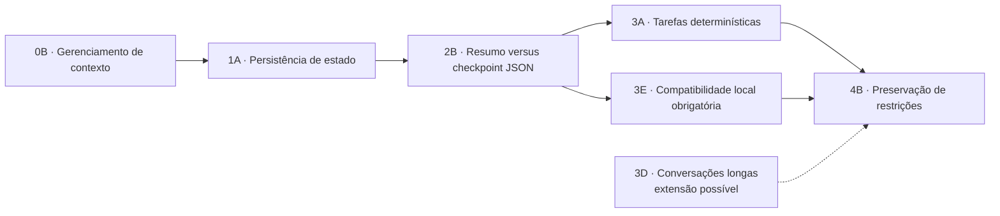

# Ficha preliminar do tema de TCC

## 1. Identificação

| Campo | Preenchimento |
| --- | --- |
| Aluno(a) | guilherme Henrique Siqueira Lopes |
| Curso / Semestre | Sistemas de Informação /7° periodo |
| Orientador(a) | Alex coelho A Confirma |
| Área | Inteligência Artificial; agentes baseados em modelos de linguagem; avaliação experimental |

## 2. Seleção atual do recorte

Foram mantidas 7 opções. Os níveis 0 e 1 definem a base do tema; o nível 2 apresenta uma comparação experimental; o nível 3 apresenta escolhas de contexto; o nível 4 contém a formulação final escolhida.

| Nível | Opção escolhida | Descrição expandida | Pergunta correspondente |
| --- | --- | --- | --- |
| 0 — Área ampla | 0B · Gerenciamento de contexto | Examina como o conteúdo disponível ao modelo é selecionado, reduzido e organizado dentro de uma janela limitada. | Como o gerenciamento de contexto influencia o desempenho de agentes baseados em modelos de linguagem? |
| 1 — Fenômeno | 1A · Persistência de estado | Focaliza a conservação explícita do estado operacional entre as etapas de uma tarefa. | Em que medida diferentes estratégias de persistência de estado afetam a confiabilidade e a eficiência de um agente baseado em SLM? |
| 2 — Comparação | 2B · Resumo × checkpoint JSON | Isola a representação do estado: texto livre produzido por sumarização versus campos explícitos e verificáveis em JSON. | Checkpoints JSON preservam melhor o estado da tarefa do que resumos textuais? |
| 3 — Contexto | 3A · Tarefas determinísticas | Emprega tarefas artificiais com estados finais, restrições e pontos de interrupção definidos previamente. | Como as estratégias se comportam em tarefas cujo estado final e restrições podem ser verificados automaticamente? |
| 3 — Contexto | 3D · Conversações longas | Distribui fatos e preferências por uma conversa extensa. É uma extensão possível, não parte do experimento principal. | Qual estratégia recupera melhor informações relevantes distribuídas ao longo de uma interação extensa? |
| 3 — Contexto obrigatório | 3E · Execução local 1–4B | Impõe compatibilidade com SLMs abertos, quantizados e executados em hardware de consumo. | Qual estratégia oferece melhor equilíbrio entre confiabilidade e custo computacional em um SLM executado localmente? |
| 4 — Candidato final | 4B · Preservação de restrições | Compara sumarização textual e checkpoint JSON, com foco na preservação de restrições em tarefas determinísticas. | Em SLMs locais, checkpoints JSON reduzem a perda de restrições quando comparados à sumarização textual? |

### Diagrama do recorte

## 3. Tema em uma frase

> **Avaliar sumarização textual e checkpoint JSON como estratégias de persistência de estado em agentes locais baseados em SLMs de 1–4B, durante a retomada de tarefas interrompidas, visando comparar sucesso final, retenção de restrições, consumo de tokens e latência.**

### Título provisório

**Persistência de estado em agentes baseados em pequenos modelos de linguagem: comparação entre sumarização textual e checkpoints JSON**

Uma versão mais específica, caso o experimento confirme sua viabilidade, seria:

**Retomada de tarefas interrompidas por agentes locais baseados em SLMs: uma avaliação de sumarização textual e checkpoints JSON**

## 4. Facetas selecionadas

| Faceta | Delimitação atual | Estado |
| --- | --- | --- |
| Objeto/Fenômeno | Efeito de estratégias externas de persistência de estado sobre agentes baseados em SLMs. | Definido |
| Contexto/Setor | Agentes locais que executam tarefas determinísticas de múltiplas etapas e precisam retomá-las depois de interrupções controladas. | Parcialmente definido |
| Público/População | Um SLM aberto, ajustado para instruções, entre 1B e 4B parâmetros, executado localmente. | Faixa definida; modelo pendente |
| Tempo | Literatura publicada principalmente entre 2023 e 2026; experimento durante o período do TCC. | Preliminar |
| Geografia | Não se aplica como população geográfica; o contexto técnico é hardware local de consumo. | Justificado |
| Dados/Fontes | Tarefas sintéticas e reproduzíveis, estados finais esperados, registros de execução e corpus bibliográfico. | Estrutura definida; tarefas pendentes |
| Método/Abordagem | Experimento quantitativo controlado, com ablação da estratégia de persistência e demais condições mantidas constantes. | Definido |
| Métricas/Variáveis | Sucesso final, sucesso após retomada, retenção de restrições, ações repetidas ou contraditórias, tokens e latência. | Definido |
| Restrições/Viabilidade | GPU com 6 GB de VRAM, 16 GB de RAM, sem treinamento completo, um modelo principal e conjunto limitado de tarefas. | Definido |

## 5. Variáveis do estudo

### Variável independente

Estratégia de persistência de estado:

1. sumarização textual;
2. checkpoint JSON.

A comparação será realizada sob condições equivalentes de tarefa, modelo, interrupção e orçamento de contexto.

### Variáveis dependentes

- taxa de conclusão correta da tarefa;
- taxa de conclusão correta após interrupção e retomada;
- proporção de restrições preservadas;
- quantidade de ações duplicadas ou contraditórias;
- tokens processados por tarefa;
- latência total e latência de retomada;
- opcionalmente, uso máximo de RAM e VRAM.

### Variáveis de controle

- mesmo modelo e quantização;
- mesmo conjunto e ordem de tarefas;
- mesmos pontos de interrupção;
- mesmo limite de passos e chamadas;
- mesma configuração de geração;
- mesmo orçamento de contexto, quando metodologicamente aplicável;
- mesmo hardware e versão do ambiente.

## 6. Matriz de verificação objetiva

| Critério | Nota | Justificativa |
| --- | --- | --- |
| Relevância | 2 | Persistência de estado é necessária para agentes confiáveis e eficientes em tarefas com várias etapas. |
| Alinhamento | 2 | O estudo se relaciona a Sistemas de Informação, IA aplicada, Machine Learning e Modelagem Computacional do Conhecimento. |
| Viabilidade temporal | 2 | É factível se limitado a um modelo principal, duas estratégias e uma família de tarefas determinísticas. |
| Acesso a dados | 2 | As tarefas, interrupções, estados esperados e logs podem ser produzidos localmente de forma determinística. |
| Delimitação/Escopo | 1 | O fenômeno e as métricas estão delimitados, mas ainda faltam modelo, domínio e quantidade de tarefas. |
| Originalidade | 1 | O recorte em SLMs locais e retomada de tarefas é justificável, mas a lacuna precisa ser confirmada pela revisão focal. |
| **Total** | **10/12** | Atende provisoriamente à meta de pelo menos 9/12, sem notas zero. |

### Interpretação

O tema já tem granularidade suficiente para ser apresentado ao orientador como proposta. Ainda não deve ser tratado como formulação definitiva porque as notas de delimitação e originalidade dependem da revisão bibliográfica focal e do piloto.

## 7. Problema de pesquisa

Apesar de agentes baseados em modelos de linguagem precisarem manter um estado consistente para concluir tarefas de múltiplas etapas, estudos sobre memória de agentes frequentemente se concentram em memória conversacional, modelos maiores ou arquiteturas complexas. Ainda há evidência limitada — lacuna a ser confirmada pela revisão bibliográfica focal — sobre como sumarização textual e checkpoints JSON afetam a retomada de tarefas por SLMs de 1–4B executados localmente. Essa incerteza dificulta escolher mecanismos de persistência que conciliem confiabilidade e custo computacional em hardware de consumo.

### Evidências bibliográficas iniciais

- **MemGPT** demonstra o gerenciamento de diferentes camadas de memória e contexto para agentes.
- **LongMemEval** avalia capacidades de memória em interações longas e evidencia diferentes tipos de falha.
- **LoCoMo** aborda memória de longo prazo em conversações extensas.
- **MemoryAgentBench** e trabalhos sobre memória estrutural de agentes oferecem dimensões de avaliação e arquiteturas relacionadas.

Esses trabalhos fundamentam a relevância do fenômeno. Entretanto, não bastam, isoladamente, para provar a originalidade do recorte específico; isso será verificado na segunda passagem da revisão.

## 8. Pergunta de pesquisa

**Em SLMs de 1–4B executados localmente, checkpoints JSON preservam melhor as restrições do que a sumarização textual na retomada de tarefas determinísticas interrompidas?**

### Pergunta alternativa mais estreita

**Em que medida sumarização textual e checkpoint JSON diferem quanto ao sucesso final, à retenção de restrições e ao custo computacional?**

## 9. Objetivos

### Objetivo geral

**Avaliar** o efeito da sumarização textual e do checkpoint JSON na confiabilidade e na eficiência de agentes baseados em SLMs locais durante a retomada de tarefas interrompidas.

### Objetivos específicos

1. **Selecionar** um SLM aberto de 1–4B compatível com o hardware disponível.
2. **Implementar** sumarização textual e checkpoint JSON em um harness experimental comum.
3. **Construir** um conjunto reproduzível de tarefas com estados esperados e pontos controlados de interrupção.
4. **Medir** conclusão, retomada, retenção de restrições, ações inconsistentes, tokens e latência.
5. **Comparar** o desempenho e o custo das estratégias sob condições equivalentes.
6. **Analisar** os padrões de falha e as ameaças à validade do experimento.
7. **Documentar** o protocolo, as configurações e os artefatos necessários à reprodução do estudo.

## 10. Hipóteses preliminares

As hipóteses servem para orientar o desenho, não como conclusões antecipadas:

- **H1:** checkpoints JSON preservam mais restrições e estado operacional do que a sumarização textual.
- **H2:** sumarização textual reduz o consumo de contexto, mas introduz maior risco de omissão ou alteração de restrições.
- **H3:** o benefício do checkpoint JSON depende da qualidade do schema e da validação dos campos persistidos.

## 11. Desenho experimental mínimo viável

| Elemento | Proposta preliminar |
| --- | --- |
| Modelo | Um SLM aberto de 1–4B, quantizado, ajustado para instruções |
| Estratégias | Duas condições: sumarização textual e checkpoint JSON |
| Tarefas | Duas ou três famílias de tarefas determinísticas de múltiplas etapas |
| Interrupções | Pontos fixos, definidos previamente em cada tarefa |
| Referência correta | Estado final esperado e conjunto explícito de restrições |
| Repetições | A definir no piloto; usar o mesmo número por condição |
| Avaliação | Regras determinísticas e análise dos registros de execução |
| Análise | Diferenças de proporções, intervalos de confiança e comparação de custo |

## 12. Decisões ainda pendentes

Antes de fechar a ficha definitiva, é necessário decidir:

1. o modelo e a quantização exatos;
2. os domínios e a quantidade de tarefas;
3. se o checkpoint será atualizado por regras, pelo SLM ou por ambas as alternativas;
4. o orçamento de contexto comum às estratégias;
5. o número de repetições e os testes estatísticos;
6. o semestre e o cronograma oficial do TCC;

### Recomendação para o piloto

Começar com checkpoint atualizado deterministicamente pelo harness. Isso isola melhor o efeito do formato de persistência. A geração do checkpoint pelo próprio SLM pode ser uma condição adicional, caso haja tempo, porque mistura dois efeitos: persistência e qualidade da extração do estado.

## 13. Critérios para validar ou reformular o tema

O tema deve ser mantido se a revisão focal e o piloto confirmarem que:

- há poucos estudos que comparem diretamente essas estratégias em SLMs locais de 1–4B;
- as tarefas permitem medir estado e restrições de forma objetiva;
- o modelo escolhido executa as tarefas básicas com frequência suficiente para permitir comparação;
- as duas condições cabem no cronograma e no hardware.

O tema deve ser estreitado se:

- houver estudos quase idênticos com o mesmo porte de modelo e protocolo;
- o número de condições tornar o experimento excessivo;
- a sumarização e o checkpoint JSON não forem comparáveis sob um orçamento justo.

Nesse caso, o recorte poderá ser reduzido para uma avaliação descritiva da sumarização textual ou do checkpoint JSON, mantendo o foco em **retenção de restrições após retomada**.

## 14. Papel do harness bibliográfico

O harness bibliográfico será um **instrumento de apoio** para buscar estudos, registrar evidências, validar a lacuna, escolher métricas e revisar decisões durante o projeto. Ele não integra o objeto experimental do TCC, a menos que o projeto seja posteriormente redirecionado para Harness Engineering.

## 15. Síntese para apresentação ao orientador

Pretende-se comparar a sumarização textual e o checkpoint JSON em agentes baseados em pequenos modelos de linguagem executados localmente. O experimento observará a retomada de tarefas interrompidas e considerará sucesso final, retenção de restrições, ações inconsistentes, tokens e latência. A contribuição pretendida é produzir evidência controlada sobre duas formas simples de persistência de estado para agentes pequenos em hardware de consumo, recorte cuja originalidade ainda será confirmada por revisão focal da literatura.