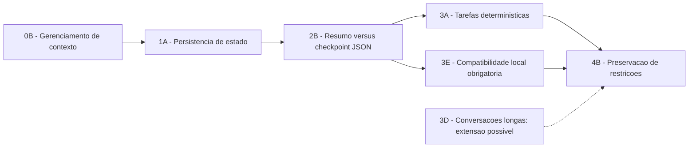

# Ficha do Tema - Trabalho de Conclusão de Curso I

## Identificação

| Campo            | Preenchimento                     |
| ---------------- | --------------------------------- |
| Aluno(a)         | Guilherme Henrique Siqueira Lopes |
| Curso / Semestre | Sistemas de Informacao - 2025/2   |
| Orientador(a)    | Alex Coelho - a confirmar         |

## Tema (1 frase)

Comparar a [[05-glossario#Sumarização textual|sumarizacao textual]] e o [[05-glossario#Checkpoint JSON|checkpoint JSON]] quanto a confiabilidade e eficiencia de agentes baseados em SLMs locais de 1-4B durante a retomada de tarefas deterministicas interrompidas.

Recorte final: [[04-candidatos-finais#4B — Preservação de restrições|4B - Preservacao de restricoes]].

## Facetas selecionadas (4-7)

| Faceta                 | Delimitacao atual                                                                                                                                                                                                                                                                                                                                                                      |
| ---------------------- | -------------------------------------------------------------------------------------------------------------------------------------------------------------------------------------------------------------------------------------------------------------------------------------------------------------------------------------------------------------------------------------- |
| Objeto/Fenomeno        | [[01-base-conceitual#1A — Persistência de estado\|Persistencia de estado operacional]] em agentes baseados em modelos de linguagem.                                                                                                                                                                                                                              |
| Contexto/Setor         | ==[[03-contextos-de-avaliacao#3A — Tarefas sintéticas e determinísticas\|Tarefas sinteticas e deterministicas]] de multiplas etapas, com estados finais, restricoes e pontos de interrupcao verificaveis.==                                                                                                                                                      |
| Publico/Populacao      | [[03-contextos-de-avaliacao#3E — Execução local com SLM de 1–4B\|SLM]] aberto, ajustado para instrucoes, com aproximadamente 1-4 bilhoes de parametros, quantizado e executado localmente.                                                                                                                                                                       |
| Tempo                  | Literatura publicada principalmente entre 2023 e 2026; experimento durante o periodo do TCC.                                                                                                                                                                                                                                                                                           |
| Geografia              | Nao se aplica como populacao geografica; o contexto tecnico e hardware local de consumo.                                                                                                                                                                                                                                                                                               |
| Dados/Fontes           | [[03-contextos-de-avaliacao#3A — Tarefas sintéticas e determinísticas\|Tarefas sinteticas reproduziveis]], estados finais esperados, restricoes explicitas, registros de execucao e corpus bibliografico.                                                                                                                                                        |
| Metodo/Abordagem       | [[02-comparacoes#2B — Resumo versus checkpoint JSON\|Experimento quantitativo controlado]] comparando sumarizacao textual e checkpoint JSON com o mesmo modelo, hardware, tarefas, pontos de interrupcao e configuracao de geracao.                                                                                                                              |
| Metricas/Variaveis     | [[06-metricas-e-protocolo#Taxa de sucesso final\|Sucesso final]], sucesso apos retomada, [[06-metricas-e-protocolo#Retenção de restrições\|retencao de restricoes]], [[06-metricas-e-protocolo#Correção do checkpoint JSON\|correcao do checkpoint JSON]], acoes inconsistentes, tokens, latencia e uso de RAM/VRAM. |
| Restricoes/Viabilidade | GPU com 6 GB de VRAM, 16 GB de RAM, sem treinamento completo, um modelo principal, uma familia de tarefas e duas estrategias de persistencia.                                                                                                                                                                                                                                          |

## Matriz de verificacao (0-2 por criterio)

| Criterio | Nota | Justificativa |
| --- | --- | --- |
| Relevancia | 2 | Persistencia de estado e importante para agentes confiaveis em tarefas de multiplas etapas. |
| Alinhamento | 2 | O estudo se relaciona a Sistemas de Informacao, Inteligencia Artificial e avaliacao experimental. |
| <mark data-color="#ff8c0066" style="background-color: rgba(255, 140, 0, 0.4); color: inherit;">Viabilidade temporal</mark> | <mark data-color="#ff8c0066" style="background-color: rgba(255, 140, 0, 0.4); color: inherit;">1</mark> | <mark data-color="#ff8c0066" style="background-color: rgba(255, 140, 0, 0.4); color: inherit;">O escopo foi reduzido a um modelo principal, uma familia de tarefas e duas estrategias.</mark> |
| Acesso a dados | 2 | Tarefas, interrupcoes, estados esperados e logs podem ser produzidos localmente de forma deterministica. |
| <mark data-color="#ff8c0066" style="background-color: rgba(255, 140, 0, 0.4); color: inherit;">Delimitacao/Escopo</mark> | <mark data-color="#ff8c0066" style="background-color: rgba(255, 140, 0, 0.4); color: inherit;">1</mark> | <mark data-color="#ff8c0066" style="background-color: rgba(255, 140, 0, 0.4); color: inherit;">O recorte define objeto, tecnicas, contexto, modelo local e metricas principais.</mark> |
| <mark data-color="#ff8c0066" style="background-color: rgba(255, 140, 0, 0.4); color: inherit;">Originalidade</mark> | <mark data-color="#ff8c0066" style="background-color: rgba(255, 140, 0, 0.4); color: inherit;">1</mark> | <mark data-color="#ff8c0066" style="background-color: rgba(255, 140, 0, 0.4); color: inherit;">A relevancia e plausivel, mas a lacuna especifica ainda precisa ser confirmada pela revisao focal.</mark> |
| **Total** | **11/12** | Proposta delimitada e viavel, com originalidade ainda dependente da revisao bibliografica. |

## Problema de pesquisa (com evidencia)

Agentes baseados em modelos de linguagem precisam manter um [[05-glossario#Estado operacional|estado operacional]] consistente para concluir tarefas de multiplas etapas. Estudos sobre memoria de agentes frequentemente se concentram em [[03-contextos-de-avaliacao#3D — Conversações longas|memoria conversacional]], modelos maiores ou arquiteturas complexas. Ainda ha evidencia limitada, a ser confirmada pela revisao bibliografica focal, sobre como [[02-comparacoes#2B — Resumo versus checkpoint JSON|sumarizacao textual e checkpoints JSON]] afetam a retomada de tarefas por SLMs de 1-4B executados localmente.

Essa incerteza dificulta escolher mecanismos de [[01-base-conceitual#1A — Persistência de estado|persistencia]] que conciliem confiabilidade e custo computacional em [[03-contextos-de-avaliacao#3E — Execução local com SLM de 1–4B|hardware de consumo]]. O problema sera investigado por meio de [[03-contextos-de-avaliacao#3A — Tarefas sintéticas e determinísticas|tarefas sinteticas e deterministicas]], nas quais o estado correto, as restricoes e o resultado final podem ser verificados automaticamente.

**Evidencias bibliograficas iniciais:** MemGPT, LongMemEval, LoCoMo, MemoryAgentBench e trabalhos sobre memoria estrutural de agentes oferecem conceitos, benchmarks e dimensoes de avaliacao relacionados. Essas referencias fundamentam a relevancia do fenomeno, mas nao comprovam isoladamente a originalidade deste recorte.

## Pergunta de pesquisa

**Em SLMs de 1-4B executados localmente, checkpoints JSON preservam melhor as restricoes do que a sumarizacao textual na retomada de tarefas deterministicas interrompidas?**

## Objetivo geral

**Comparar** a sumarizacao textual e o checkpoint JSON quanto a confiabilidade e a eficiencia de agentes baseados em SLMs locais durante a retomada de tarefas deterministicas interrompidas.

## Objetivos especificos

1. medir  sucesso apos retomada, 
2. retencao de restricoes, 
3. acoes inconsistentes, 
4. tokens utilizados 
5. ==latencia==

---

## Comentarios adicionais sobre o recorte

Esta secao nao faz parte dos campos obrigatorios do template oficial. Ela registra decisoes metodologicas complementares tomadas durante a delimitacao do tema.

### Rota de delimitacao

### Variavel independente

A variavel independente e a estrategia de persistencia, com dois niveis:

1. **[[02-comparacoes#2B — Resumo versus checkpoint JSON|Sumarizacao textual]]:** substitui parte do historico por um resumo em linguagem natural.
2. **[[05-glossario#Checkpoint JSON|Checkpoint JSON]]:** persiste o estado operacional em campos estruturados.

A execucao continua e a interrupcao controlada sao condicoes do protocolo, nao estrategias adicionais.

### Modelos previamente selecionados para o piloto

Detalhes de compatibilidade e familias arquiteturais: [[03-contextos-de-avaliacao#3E — Execução local com SLM de 1–4B|3E - Execucao local com SLM de 1-4B]].

| Modelo | Familia arquitetural | Funcao preliminar |
| --- | --- | --- |
| Qwen2.5-3B-Instruct | Transformer decoder-only | Baseline Transformer A |
| Phi-3.5-mini-Instruct ou Gemma pequeno equivalente | Transformer decoder-only | Baseline Transformer B |
| RecurrentGemma 2B-IT | Griffin, com atencao local e recorrencia | Arquitetura hibrida recorrente |
| Mamba aproximadamente 2.8B instruction-tuned | State Space Model (SSM) | Arquitetura baseada em estado |

### Variaveis dependentes principais

- **Taxa de sucesso final:** execucoes corretas divididas pelo total de execucoes.
- **Sucesso apos retomada:** execucoes interrompidas que concluem corretamente a tarefa depois da restauracao.
- **Retencao de restricoes:** restricoes preservadas divididas pelas restricoes esperadas.
- **<mark data-color="#ff8c0066" style="background-color: rgba(255, 140, 0, 0.4); color: inherit;">Correcao do checkpoint JSON:</mark>**<mark data-color="#ff8c0066" style="background-color: rgba(255, 140, 0, 0.4); color: inherit;"> campos corretos divididos pelos campos avaliaveis.</mark>
- **Acoes inconsistentes:** acoes duplicadas, contraditorias, invalidas ou fora de ordem.
- **Consumo de tokens:** tokens de entrada e saida de todas as chamadas, incluindo a sumarizacao ou a producao do checkpoint JSON.

No checkpoint JSON, registrar separadamente campos ausentes, valores alterados, campos inventados e estrutura invalida.

### Hipoteses preliminares

- **H1:** checkpoints JSON preservam mais restricoes e estado operacional do que a sumarizacao textual.
- **H2:** a sumarizacao textual pode conservar nuances abertas, mas apresenta maior risco de omissao ou reformulacao de restricoes.
- **<mark data-color="#ff8c0066" style="background-color: rgba(255, 140, 0, 0.4); color: inherit;">H3:</mark>**<mark data-color="#ff8c0066" style="background-color: rgba(255, 140, 0, 0.4); color: inherit;"> o beneficio do checkpoint JSON depende da qualidade do schema e da validacao dos campos persistidos.</mark>

### Observacao sobre o estado da pesquisa

<mark data-color="#ff8c0066" style="background-color: rgba(255, 140, 0, 0.4); color: inherit;">A originalidade do recorte deve ser confirmada por revisao bibliografica focal,\
a viabilidade deve ser verificada por um piloto com a condicao de execucao continua antes da comparacao das duas estrategias.</mark>