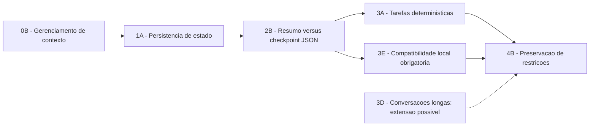

# Ficha do Tema - Trabalho de Conclusão de Curso I

## Identificação

| Campo            | Preenchimento                     |
| ---------------- | --------------------------------- |
| Aluno(a)         | Guilherme Henrique Siqueira Lopes |
| Curso / Semestre | Sistemas de Informacao - 2025/2   |
| Orientador(a)    | Alex Coelho - a confirmar         |

## Tema (1 frase)

Comparar a [[05-glossario#Sumarização textual|sumarizacao textual]] e o [[05-glossario#Checkpoint JSON|checkpoint JSON]] quanto a confiabilidade e eficiencia de agentes baseados em SLMs locais de 1-4B durante a retomada de tarefas deterministicas interrompidas. A pertinencia de comparar estruturas distintas de memoria e sustentada por estudos que mostram que a representacao da memoria influencia o desempenho de agentes. [[citacoes_academicas/02-estruturas-de-memoria-sumarizacao-e-json|Evidencia academica: estruturas de memoria]]

Recorte final: [[04-candidatos-finais#4B — Preservação de restrições|4B - Preservacao de restricoes]]. **Decisao de delimitacao deste estudo.**

## Facetas selecionadas (4-7)

| Faceta                 | Delimitacao atual |
| ---------------------- | ----------------- |
| Objeto/Fenomeno        | [[01-base-conceitual#1A — Persistência de estado\|Persistencia de estado operacional]] em agentes baseados em modelos de linguagem. A literatura recente trata memoria e consciencia de estado como componentes relevantes para continuidade, planejamento e confiabilidade de agentes. [[citacoes_academicas/01-memoria-e-persistencia-em-agentes|Evidencia academica]] |
| Contexto/Setor         | ==[[03-contextos-de-avaliacao#3A — Tarefas sintéticas e determinísticas\|Tarefas sinteticas e deterministicas]] de multiplas etapas, com estados finais, restricoes e pontos de interrupcao verificaveis.== **Decisao metodologica deste estudo**, motivada pela necessidade de avaliacao objetiva de memoria e retomada. [[citacoes_academicas/03-benchmarks-de-memoria-e-long-horizon|Contexto de benchmarks de memoria]] |
| Publico/Populacao      | [[03-contextos-de-avaliacao#3E — Execução local com SLM de 1–4B\|SLM]] aberto, ajustado para instrucoes, com aproximadamente 1-4 bilhoes de parametros, quantizado e executado localmente. Estudos sobre SLMs cobrem modelos de centenas de milhoes a poucos bilhoes de parametros e medem latencia/footprint de memoria em execucao local. [[citacoes_academicas/04-slms-execucao-local-e-quantizacao|Evidencia academica]] |
| Tempo                  | Literatura publicada principalmente entre 2023 e 2026; experimento durante o periodo do TCC. **Criterio de busca e recorte temporal deste estudo.** |
| Geografia              | Nao se aplica como populacao geografica; o contexto tecnico e hardware local de consumo. **Decisao de escopo.** |
| Dados/Fontes           | [[03-contextos-de-avaliacao#3A — Tarefas sintéticas e determinísticas\|Tarefas sinteticas reproduziveis]], estados finais esperados, restricoes explicitas, registros de execucao e corpus bibliografico. **Desenho de dados deste estudo.** |
| Metodo/Abordagem       | [[02-comparacoes#2B — Resumo versus checkpoint JSON\|Experimento quantitativo controlado]] comparando sumarizacao textual e checkpoint JSON com o mesmo modelo, hardware, tarefas, pontos de interrupcao e configuracao de geracao. A literatura mostra que estruturas de memoria distintas podem produzir resultados distintos, justificando a comparacao controlada. [[citacoes_academicas/02-estruturas-de-memoria-sumarizacao-e-json|Evidencia academica]] |
| Metricas/Variaveis     | [[06-metricas-e-protocolo#Taxa de sucesso final\|Sucesso final]], sucesso apos retomada, [[06-metricas-e-protocolo#Retenção de restrições\|retencao de restricoes]], [[06-metricas-e-protocolo#Correção do checkpoint JSON\|correcao do checkpoint JSON]], acoes inconsistentes, tokens, latencia e uso de RAM/VRAM. Benchmarks de memoria e trabalhos de eficiencia usam medidas de desempenho, tokens, latencia e memoria como dimensoes de avaliacao. [[citacoes_academicas/03-benchmarks-de-memoria-e-long-horizon|Memoria/long-horizon]]; [[citacoes_academicas/04-slms-execucao-local-e-quantizacao|Eficiencia local]] |
| Restricoes/Viabilidade | GPU com 6 GB de VRAM, 16 GB de RAM, sem treinamento completo, um modelo principal, uma familia de tarefas e duas estrategias de persistencia. **Restricoes concretas de viabilidade deste estudo**; a literatura sustenta apenas que memoria, latencia e quantizacao sao fatores relevantes em implantacao limitada por recursos. [[citacoes_academicas/04-slms-execucao-local-e-quantizacao|Evidencia relacionada]] |

## Matriz de verificacao (0-2 por criterio)

| Criterio | Nota | Justificativa |
| --- | --- | --- |
| Relevancia | 2 | Persistencia de estado e importante para agentes confiaveis em tarefas de multiplas etapas; trabalhos recentes associam memoria/estado persistente a continuidade, planejamento e confiabilidade. [[citacoes_academicas/01-memoria-e-persistencia-em-agentes|Evidencia academica]] |
| Alinhamento | 2 | O estudo se relaciona a Sistemas de Informacao, Inteligencia Artificial e avaliacao experimental. **Avaliacao de enquadramento curricular deste projeto.** |
| <mark data-color="#ff8c0066" style="background-color: rgba(255, 140, 0, 0.4); color: inherit;">Viabilidade temporal</mark> | <mark data-color="#ff8c0066" style="background-color: rgba(255, 140, 0, 0.4); color: inherit;">1</mark> | <mark data-color="#ff8c0066" style="background-color: rgba(255, 140, 0, 0.4); color: inherit;">O escopo foi reduzido a um modelo principal, uma familia de tarefas e duas estrategias.</mark> **Decisao de projeto.** |
| Acesso a dados | 2 | Tarefas, interrupcoes, estados esperados e logs podem ser produzidos localmente de forma deterministica. **Propriedade do protocolo proposto, a ser validada no piloto.** |
| <mark data-color="#ff8c0066" style="background-color: rgba(255, 140, 0, 0.4); color: inherit;">Delimitacao/Escopo</mark> | <mark data-color="#ff8c0066" style="background-color: rgba(255, 140, 0, 0.4); color: inherit;">1</mark> | <mark data-color="#ff8c0066" style="background-color: rgba(255, 140, 0, 0.4); color: inherit;">O recorte define objeto, tecnicas, contexto, modelo local e metricas principais.</mark> **Avaliacao interna do escopo.** |
| <mark data-color="#ff8c0066" style="background-color: rgba(255, 140, 0, 0.4); color: inherit;">Originalidade</mark> | <mark data-color="#ff8c0066" style="background-color: rgba(255, 140, 0, 0.4); color: inherit;">1</mark> | <mark data-color="#ff8c0066" style="background-color: rgba(255, 140, 0, 0.4); color: inherit;">A relevancia e plausivel, mas a lacuna especifica ainda precisa ser confirmada pela revisao focal.</mark> As fontes encontradas comparam estruturas de memoria e avaliam memoria de longo prazo, mas nao demonstram diretamente o recorte exato "checkpoint JSON versus sumarizacao textual em retomada de tarefas deterministicas por SLMs 1-4B". [[citacoes_academicas/02-estruturas-de-memoria-sumarizacao-e-json|Estruturas de memoria]]; [[citacoes_academicas/03-benchmarks-de-memoria-e-long-horizon|Benchmarks]] |
| **Total** | **11/12** | Proposta delimitada e viavel, com originalidade ainda dependente da revisao bibliografica focal. |

## Problema de pesquisa (com evidencia)

Agentes baseados em modelos de linguagem precisam manter um [[05-glossario#Estado operacional|estado operacional]] consistente para concluir tarefas de multiplas etapas; estudos recentes mostram que memoria persistente e consciencia de estado sao relevantes para continuidade, planejamento, recuperacao de falhas e confiabilidade. [[citacoes_academicas/01-memoria-e-persistencia-em-agentes|Evidencia academica: memoria e persistencia]]

Estudos sobre memoria de agentes frequentemente se concentram em [[03-contextos-de-avaliacao#3D — Conversações longas|memoria conversacional]], interacoes multi-sessao e arquiteturas externas de memoria. LoCoMo e MemoryAgentBench, por exemplo, avaliam memoria de longo prazo, compreensao de longo alcance, recuperacao e resolucao de conflitos em contextos interativos. [[citacoes_academicas/03-benchmarks-de-memoria-e-long-horizon|Evidencia academica: benchmarks]]

A forma de representar a memoria tambem importa: trabalhos comparam resumos, fatos atomicos, triplas e memorias mistas, enquanto outro estudo relata ganhos com representacoes estruturadas em JSON na sumarizacao incremental. [[citacoes_academicas/02-estruturas-de-memoria-sumarizacao-e-json|Evidencia academica: estruturas e JSON]]

Ainda ha evidencia limitada, a ser confirmada pela revisao bibliografica focal, sobre como [[02-comparacoes#2B — Resumo versus checkpoint JSON|sumarizacao textual e checkpoints JSON]] afetam especificamente a retomada de tarefas deterministicas interrompidas por SLMs de 1-4B executados localmente. **Esta frase e uma afirmacao de lacuna, nao uma conclusao definitiva:** as buscas localizaram literatura proxima, mas nao uma comparacao diretamente equivalente. [[citacoes_academicas/02-estruturas-de-memoria-sumarizacao-e-json|Literatura mais proxima]]; [[citacoes_academicas/04-slms-execucao-local-e-quantizacao|Literatura sobre SLMs locais]]

Essa incerteza dificulta escolher mecanismos de [[01-base-conceitual#1A — Persistência de estado|persistencia]] que conciliem confiabilidade e custo computacional em [[03-contextos-de-avaliacao#3E — Execução local com SLM de 1–4B|hardware de consumo]]. A literatura sobre SLMs e quantizacao mostra trade-offs entre desempenho, memoria e latencia em ambientes limitados por recursos. [[citacoes_academicas/04-slms-execucao-local-e-quantizacao|Evidencia academica: SLMs e eficiencia]]

O problema sera investigado por meio de [[03-contextos-de-avaliacao#3A — Tarefas sintéticas e determinísticas|tarefas sinteticas e deterministicas]], nas quais o estado correto, as restricoes e o resultado final podem ser verificados automaticamente. **Este e o desenho metodologico proposto pelo TCC, a ser validado no piloto.**

**Evidencias bibliograficas iniciais:** trabalhos sobre memoria estrutural de agentes, LoCoMo, MemoryAgentBench e estudos de memoria persistente oferecem conceitos, benchmarks e dimensoes de avaliacao relacionados. [[citacoes_academicas/01-memoria-e-persistencia-em-agentes|Memoria/persistencia]]; [[citacoes_academicas/02-estruturas-de-memoria-sumarizacao-e-json|Estruturas]]; [[citacoes_academicas/03-benchmarks-de-memoria-e-long-horizon|Benchmarks]]. Essas referencias fundamentam a relevancia do fenomeno, mas nao comprovam isoladamente a originalidade deste recorte.

## Pergunta de pesquisa

**Em SLMs de 1-4B executados localmente, checkpoints JSON preservam melhor as restricoes do que a sumarizacao textual na retomada de tarefas deterministicas interrompidas?**

A pergunta e experimental. A literatura torna a comparacao plausivel, mas nao fornece resposta previa para o protocolo exato. [[citacoes_academicas/02-estruturas-de-memoria-sumarizacao-e-json|Evidencia relacionada]]

## Objetivo geral

**Comparar** a sumarizacao textual e o checkpoint JSON quanto a confiabilidade e a eficiencia de agentes baseados em SLMs locais durante a retomada de tarefas deterministicas interrompidas. **Objetivo definido por este estudo.**

## Objetivos especificos

1. medir sucesso apos retomada;
2. medir retencao de restricoes;
3. contabilizar acoes inconsistentes;
4. medir tokens utilizados;
5. medir latencia.

As dimensoes de desempenho, tokens e latencia sao coerentes com avaliacoes recentes de memoria e eficiencia de modelos. [[citacoes_academicas/03-benchmarks-de-memoria-e-long-horizon|Benchmarks de memoria]]; [[citacoes_academicas/04-slms-execucao-local-e-quantizacao|Eficiencia de SLMs]]

---

## Comentarios adicionais sobre o recorte

Esta secao nao faz parte dos campos obrigatorios do template oficial. Ela registra decisoes metodologicas complementares tomadas durante a delimitacao do tema.

### Rota de delimitacao

**Rota de delimitacao criada para este TCC; nao e uma taxonomia retirada da literatura.**

### Variavel independente

A variavel independente e a estrategia de persistencia, com dois niveis. **Definicao operacional deste estudo:**

1. **[[02-comparacoes#2B — Resumo versus checkpoint JSON|Sumarizacao textual]]:** substitui parte do historico por um resumo em linguagem natural. Resumos sao uma estrutura de memoria estudada na literatura de agentes. [[citacoes_academicas/02-estruturas-de-memoria-sumarizacao-e-json|Evidencia academica]]
2. **[[05-glossario#Checkpoint JSON|Checkpoint JSON]]:** persiste o estado operacional em campos estruturados. Representacoes estruturadas/JSON apresentam resultados promissores em trabalhos relacionados, mas o efeito no protocolo deste TCC ainda sera testado. [[citacoes_academicas/02-estruturas-de-memoria-sumarizacao-e-json|Evidencia relacionada]]

A execucao continua e a interrupcao controlada sao condicoes do protocolo, nao estrategias adicionais. **Decisao metodologica deste estudo.**

### Modelos previamente selecionados para o piloto

Detalhes de compatibilidade e familias arquiteturais: [[03-contextos-de-avaliacao#3E — Execução local com SLM de 1–4B|3E - Execucao local com SLM de 1-4B]]. A literatura sobre os modelos/familias esta consolidada em [[citacoes_academicas/05-modelos-do-piloto|Modelos do piloto]].

| Modelo | Familia arquitetural | Funcao preliminar |
| --- | --- | --- |
| Qwen2.5-3B-Instruct | Transformer decoder-only | Baseline Transformer A; Qwen2.5 3B aparece em estudos recentes de SLMs. [[citacoes_academicas/05-modelos-do-piloto#Qwen2.5-3B-Instruct|Referencia]] |
| Phi-3.5-mini-Instruct ou Gemma pequeno equivalente | Transformer decoder-only | Baseline Transformer B; o Phi-3-mini e documentado como modelo de 3.8B adequado a implantacao local. [[citacoes_academicas/05-modelos-do-piloto#Phi-3 Mini|Referencia]] |
| RecurrentGemma 2B-IT | Griffin, com atencao local e recorrencia | Arquitetura hibrida recorrente; o artigo original descreve estado de tamanho fixo e inferencia eficiente. [[citacoes_academicas/05-modelos-do-piloto#RecurrentGemma 2B|Referencia]] |
| Mamba aproximadamente 2.8B instruction-tuned | State Space Model (SSM) | Arquitetura baseada em estado; a literatura caracteriza Mamba como SSM com inferencia eficiente e escala linear no comprimento da sequencia. O checkpoint exato ainda precisa ser fixado. [[citacoes_academicas/05-modelos-do-piloto#Mamba / State Space Models|Referencia]] |

### Variaveis dependentes principais

As formulas abaixo sao **definicoes operacionais deste estudo**, inspiradas em dimensoes usadas por benchmarks de memoria e estudos de eficiencia. [[citacoes_academicas/03-benchmarks-de-memoria-e-long-horizon|Benchmarks]]; [[citacoes_academicas/04-slms-execucao-local-e-quantizacao|Eficiencia]]

- **Taxa de sucesso final:** execucoes corretas divididas pelo total de execucoes.
- **Sucesso apos retomada:** execucoes interrompidas que concluem corretamente a tarefa depois da restauracao.
- **Retencao de restricoes:** restricoes preservadas divididas pelas restricoes esperadas.
- **<mark data-color="#ff8c0066" style="background-color: rgba(255, 140, 0, 0.4); color: inherit;">Correcao do checkpoint JSON:</mark>** <mark data-color="#ff8c0066" style="background-color: rgba(255, 140, 0, 0.4); color: inherit;">campos corretos divididos pelos campos avaliaveis.</mark>
- **Acoes inconsistentes:** acoes duplicadas, contraditorias, invalidas ou fora de ordem.
- **Consumo de tokens:** tokens de entrada e saida de todas as chamadas, incluindo a sumarizacao ou a producao do checkpoint JSON.

No checkpoint JSON, registrar separadamente campos ausentes, valores alterados, campos inventados e estrutura invalida. **Regra de instrumentacao do experimento.**

### Hipoteses preliminares

As hipoteses abaixo **nao sao tratadas como fatos demonstrados**; sao proposicoes a testar. A literatura fornece apenas plausibilidade relacionada. [[citacoes_academicas/02-estruturas-de-memoria-sumarizacao-e-json|Base relacionada]]

- **H1:** checkpoints JSON preservam mais restricoes e estado operacional do que a sumarizacao textual. Evidencia relacionada mostra que estruturas de memoria importam e que representacoes JSON podem melhorar processamento incremental, mas nao testa esta hipotese no mesmo protocolo. [[citacoes_academicas/02-estruturas-de-memoria-sumarizacao-e-json|Evidencia indireta]]
- **H2:** a sumarizacao textual pode conservar nuances abertas, mas apresenta maior risco de omissao ou reformulacao de restricoes. A literatura compara resumos com estruturas mais atomicas/estruturadas, mas esta formulacao especifica permanece hipotese. [[citacoes_academicas/02-estruturas-de-memoria-sumarizacao-e-json|Evidencia relacionada]]
- **<mark data-color="#ff8c0066" style="background-color: rgba(255, 140, 0, 0.4); color: inherit;">H3:</mark>** <mark data-color="#ff8c0066" style="background-color: rgba(255, 140, 0, 0.4); color: inherit;">o beneficio do checkpoint JSON depende da qualidade do schema e da validacao dos campos persistidos.</mark> Esta e uma hipotese de engenharia coerente com resultados de memoria estruturada, mas ainda precisa ser avaliada diretamente. [[citacoes_academicas/02-estruturas-de-memoria-sumarizacao-e-json|Evidencia relacionada]]

### Observacao sobre o estado da pesquisa

<mark data-color="#ff8c0066" style="background-color: rgba(255, 140, 0, 0.4); color: inherit;">A originalidade do recorte deve ser confirmada por revisao bibliografica focal; a viabilidade deve ser verificada por um piloto com a condicao de execucao continua antes da comparacao das duas estrategias.</mark>

A revisao via SciSpace encontrou literatura forte sobre memoria persistente, estruturas de memoria, benchmarks long-horizon e SLMs locais, mas nao uma avaliacao diretamente equivalente ao recorte completo proposto. [[citacoes_academicas/README|Indice das citacoes academicas]]
