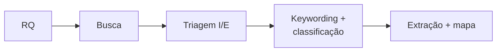
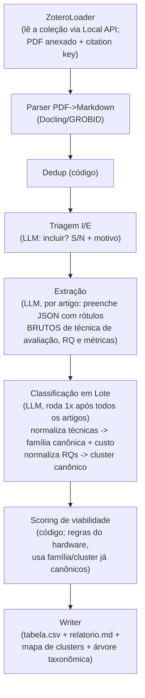
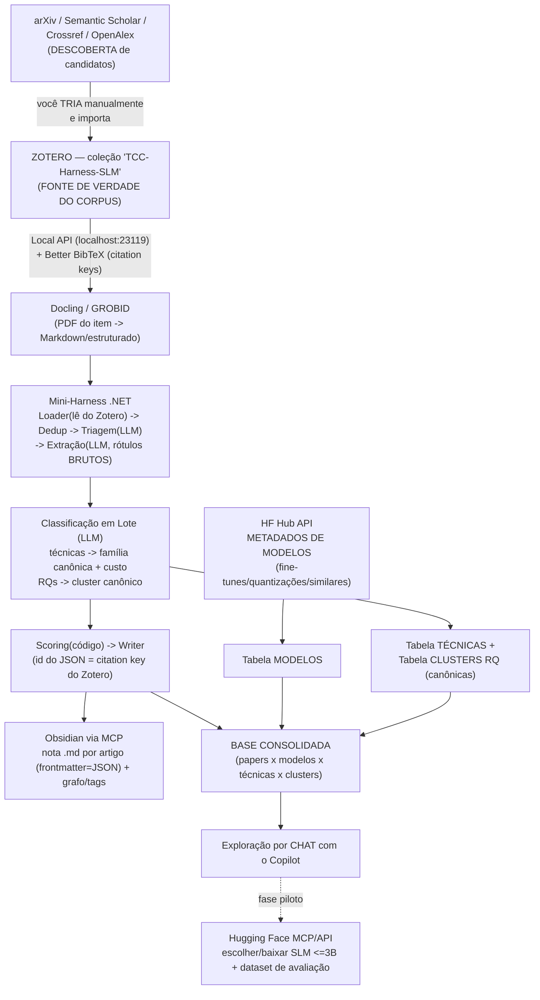

# Planejamento Completo — Mini-Harness de Triagem Bibliográfica (Opção A, .NET + Copilot SDK)

> **Objetivo da ferramenta:** ler artigos sobre *harness engineering* e correlatos,
> fazer levantamento de:
>
> - (a) TÉCNICAS DE AVALIAÇÃO
> - (b) PERGUNTAS DE PESQUISA
> - (c) MÉTRICAS
>
> com clustering e árvore taxonômica dessas características, e classificar cada
> artigo por VIABILIDADE de virar um TCC no meu hardware. NÃO é o TCC — é o
> instrumento de descoberta que o antecede.
>
> **Hardware alvo:** Notebook IdeaPad Gaming 3i — i5 10ª ger., GTX 1060 (6 GB VRAM),
> 16 GB RAM, Windows 11. Limite prático: SLM <=3B folgado; <=7-8B Q4 apertado; sem
> fine-tune completo e sem modelos >=13B.
>
> **Integração:** feita pelo Copilot (agente) amarrando as peças. .NET inicialmente.

---

## 1. Ancoragem metodológica

Pipeline canônico de revisão bibliográfica (Petersen et al. 2008/2015; Kitchenham &
Charters 2007):



O mini-harness (Opção A — sequencial) espelha esse pipeline:



Referências: Petersen (2008; 2015) mapping studies; Kitchenham & Charters (2007) SLR;
Wohlin (2014) snowballing.

---

## 2. Levantamento de TÉCNICAS DE AVALIAÇÃO (o que a ferramenta deve detectar)

O harness extrai a técnica de avaliação de cada artigo em texto livre durante a
Extração (rótulo bruto, campo `familia_avaliacao_bruta` — seção 4). A tabela
abaixo é uma taxonomia-SEMENTE (ponto de partida), não uma lista fechada — novas
famílias podem ser propostas pelo passo de Classificação em Lote (seção 2.1).

| Família de avaliação            | Descrição                                          | Custo p/ mim |
|---------------------------------|----------------------------------------------------|--------------|
| Exact-match / Accuracy          | Compara saída com gabarito exato                   | Baixo        |
| Pass@k / Pass^k                 | Fração de execuções corretas em k tentativas       | Baixo-Médio  |
| Métricas de referência (BLEU/ROUGE/BERTScore) | Similaridade com texto de referência    | Baixo-Médio  |
| Rubric-based scoring            | Pontuação por critérios definidos                  | Médio        |
| LLM-as-judge                    | Um LLM avalia a saída de outro                     | Médio-Alto*  |
| Human evaluation                | Anotadores humanos julgam                          | Alto         |
| Trajectory/behavioral eval      | Avalia o caminho de execução do agente, não só saída | Alto       |
| Constrained decoding validation | Verifica JSON/schema válido (determinístico)       | Baixo        |
| Benchmark suite (GAIA, ToolBench, etc.) | Rodar bateria padronizada                   | varia        |

*LLM-as-judge é Médio-Alto porque depende de um modelo forte; se usar SLM local como
juiz o custo cai, mas a confiabilidade também — isso é, por si só, um tema de TCC.

**Insight para escolher tema:** as famílias de custo BAIXO (exact-match, pass@k,
constrained-decoding validation) são as mais viáveis para um TCC solo em 8 meses.

### 2.1 Passo de Classificação de Técnicas (LLM, em lote)

Após a Extração de todos os artigos, um LLM roda em lote sobre a lista de rótulos
brutos únicos e:
1. Mapeia cada rótulo para uma família-semente existente, OU
2. Propõe uma nova família (nome, descrição, custo de reprodução estimado) quando
   nenhuma das 9 famílias-semente encaixa bem.
3. Atualiza a Tabela de Técnicas (canônica), que passa a alimentar o campo
   `familia_avaliacao` do contrato JSON (seção 4) e o scoring (seção 5) — que
   consulta o custo pela Tabela em vez de nomes fixos no código.

---

## 3. PERGUNTAS DE PESQUISA (RQ) — clusters emergentes

O harness extrai a RQ de cada artigo em texto livre durante a Extração (rótulo
bruto, campo `pergunta_pesquisa_bruta` — seção 4). Os clusters abaixo são um
conjunto-SEMENTE (ponto de partida), não uma lista fechada — mesmo tratamento
dado às famílias de avaliação (seção 2).

### Cluster 1 — Eficiência / Custo
- Métricas: latência (ms), throughput (tok/s), VRAM/RAM (GB), custo por token, energia.
- RQ-tipo: "Qual o trade-off custo x qualidade de um SLM vs LLM na tarefa X?"

### Cluster 2 — Qualidade / Capacidade
- Métricas: accuracy, pass@k, F1, exact-match, taxa de JSON válido.
- RQ-tipo: "Um SLM ajustado atinge quanta % do desempenho de um LLM na tarefa X?"

### Cluster 3 — Reprodutibilidade / Acessibilidade
- Métricas: roda em hardware de consumo? seed fixa? código aberto? dataset público?
- RQ-tipo: "É reprodutível avaliar agentes com recursos modestos?"

### Cluster 4 — Confiabilidade de Avaliação
- Métricas: concordância humano-LLM (kappa), estabilidade pass^k, viés do juiz.
- RQ-tipo: "SLM-as-judge é confiável comparado a humano/LLM grande?"

### Cluster 5 — Capacidade Agêntica
- Métricas: taxa de tool-calling correto, aderência a schema, sucesso multi-step.
- RQ-tipo: "SLMs conseguem function-calling confiável sem LLM de apoio?"

### 3.6 Passo de Classificação de RQs (LLM, em lote)

Após a Extração de todos os artigos, um LLM roda em lote sobre a lista de RQs
brutas e:
1. Mapeia cada RQ para um cluster-semente existente, OU
2. Propõe um novo cluster (nome, descrição, métricas típicas) quando nenhum dos
   5 clusters-semente encaixa bem.
3. Atualiza a Tabela de Clusters RQ (canônica), que passa a alimentar o campo
   `cluster_rq` do contrato JSON (seção 4), o scoring (seção 5) e o relatorio.md.

O relatorio.md deve agrupar os artigos por cluster canônico e mostrar quais
métricas predominam em cada um — esse é o "mapa de métricas clusterizadas". Além
disso, as métricas recebem uma árvore taxonômica própria (ortogonal aos clusters
de RQ), agrupando-as por natureza (desempenho, qualidade, confiabilidade,
reprodutibilidade) — ver Writer na seção 1.

---

## 4. Formulário de extração (contrato JSON — saída por artigo)

```json
{
  "id": "DOI ou chave bibtex",
  "titulo": "string",
  "ano": 0,
  "incluido": true,
  "motivo_triagem": "frase curta",
  "pergunta_pesquisa_bruta": "RQ do artigo em 1 frase (texto livre, como extraída)",
  "cluster_rq": "eficiencia | qualidade | reprodutibilidade | confiabilidade | agentico | outro:<nome>",
  "tecnica_principal": "distillation | LLM-as-judge | tool-calling | RAG | quantization | ...",
  "familia_avaliacao_bruta": ["rótulo como aparece no paper", "..."],
  "familia_avaliacao": ["exact-match", "pass@k", "rubric", "llm-as-judge", "humano", "outro:<nome>"],
  "metricas": ["accuracy", "latencia", "vram", "kappa", "..."],
  "tamanho_modelo_B": "3 | 7 | >=70 | nao-informado",
  "precisa_gpu_cara": "sim | nao | incerto",
  "reprodutivel_hardware_modesto": "sim | nao | incerto",
  "esforco_reproducao_estimado": "baixo | medio | alto",
  "keywords": ["...", "..."],
  "trecho_evidencia": "citação literal curta",
  "confianca": "alta | media | baixa"
}
```

Os campos `*_bruta` são preenchidos na Extração (por artigo, texto livre). Os
campos canônicos `cluster_rq` e `familia_avaliacao` só são consolidados depois,
pelo passo de Classificação em Lote (seções 2.1 e 3.6) — que também pode propor
novas famílias/clusters (`outro:<nome>`) quando nada existente encaixa bem.

`score_feasibility` (código) combina tamanho_modelo_B, precisa_gpu_cara,
reprodutivel_hardware_modesto, esforco_reproducao_estimado e familia_avaliacao
(canônica).

---

## 5. Regras de viabilidade (calibradas p/ GTX 1060 6GB)

```
Se tamanho_modelo_B <= 3            -> base = ALTO
Se 3 < tamanho <= 8                 -> base = MEDIO
Se tamanho > 8 (ou fine-tune full)  -> base = BAIXO/INVIAVEL

Rebaixa 1 nível se: precisa_gpu_cara = sim
Rebaixa 1 nível se: esforco = alto
Rebaixa 1 nível se: familia_avaliacao (canônica) inclui técnica de custo ALTO
                     (consulta à Tabela de Técnicas, seção 2.1)
Sobe 1 nível se: familia_avaliacao (canônica) inclui técnica de custo BAIXO
                  (consulta à Tabela de Técnicas, seção 2.1)
```

Artigos com score ALTO = candidatos ideais a tema de TCC.

---

## 6. Análise de viabilidade — INTEGRAÇÃO com Zotero, MCPs e APIs gratuitas

Objetivo: usar ferramentas gratuitas para (a) CURAR o corpus de forma reprodutível,
(b) baixar/parsear artigos para Markdown, (c) organizar o conhecimento,
(d) acelerar o trabalho. Tudo amarrado pelo Copilot.

### 6.0 Zotero — FONTE DE VERDADE DO CORPUS (peça central)

Por que Zotero é o que torna a ferramenta academicamente defensável:

| Sem Zotero                         | Com Zotero                                          |
|------------------------------------|-----------------------------------------------------|
| "Pasta de PDFs no notebook"        | Corpus versionado e curado manualmente              |
| Não reprodutível / não auditável   | Reprodutível: quem tiver a coleção refaz a análise  |
| Seleção difícil de justificar      | Critério de seleção explícito e rastreável          |
| Refazer análise = bagunça          | Expandir/limitar = editar a coleção e re-rodar      |

Workflow desenhado por você (correto e alinhado a Kitchenham):
1. Criar um PROJETO no Zotero = uma coleção (ex.: "TCC-Harness-SLM").
2. Baixar os artigos MANUALMENTE e linká-los na coleção (você é o critério humano de
   seleção — o "study selection" documentado da RSL).
3. O mini-harness LÊ dessa coleção (nunca de uma pasta solta). O corpus da análise
   É a coleção do Zotero, ponto.
4. Para refazer com escopo maior/menor: adicionar/remover itens na coleção e re-rodar.
   A rastreabilidade fica automática (a coleção é o registro do que entrou).

Como o .NET acessa o Zotero (sem depender de plugin/nuvem):

| Método de acesso | Endpoint / Fonte | Chave? | Offline? | Nota |
|------------------|------------------|--------|----------|------|
| Zotero Local API (Zotero 7+) | http://localhost:23119/api/ | Não | Sim | RECOMENDADO — REST local, leitura da biblioteca/coleções/itens/attachments |
| Better BibTeX (plugin) | export .bib/.json auto-atualizado | Não | Sim | ÓTIMO p/ citation keys estáveis e export reprodutível |
| Web API (api.zotero.org) | nuvem, precisa API key + library ID | Sim | Não | só se quiser sincronizar/remoto |
| Leitura direta do zotero.sqlite | arquivo local | Não | Sim | possível, porém frágil (schema interno) — evitar |
| zotero-mcp-server (PyPI) | MCP local (ZOTERO_LOCAL=true) | Não | Sim | útil se quiser o Copilot conversando com a lib direto |

Pré-requisito comum: app Zotero desktop aberto, com a Local API habilitada em
Settings -> Advanced -> "Allow other applications on this computer to communicate
with Zotero". Instalar o plugin Better BibTeX p/ citation keys estáveis.

O que o mini-harness lê do Zotero:
- Lista de itens da coleção "TCC-Harness-SLM" (título, autores, ano, DOI, tags).
- Caminho do PDF anexado de cada item (para o parser PDF->Markdown).
- Citation key (Better BibTeX) como `id` no contrato JSON (seção 4) -> rastreável.

Assim, o campo `id` do JSON = citation key do Zotero, fechando o ciclo:
cada linha da tabela.csv aponta de volta para um item exato da coleção.
### 6.1 Parse de artigos PDF -> Markdown

| Ferramenta | Tipo | Gratuito? | Roda local? | Recomendação |
|-----------|------|-----------|-------------|--------------|
| **Docling** (IBM) | lib Python | Sim (open-source) | Sim | ALTA — PDF->MD/JSON com layout, tabelas |
| **GROBID** | serviço Java | Sim (open-source) | Sim (Docker) | ALTA p/ extrair metadados/referências estruturadas (TEI XML) |
| **PdfPig / PDFsharp** | lib .NET | Sim | Sim | MÉDIA — extração de texto puro (já no projeto .NET) |
| **marker / markitdown** | lib Python | Sim | Sim | MÉDIA-ALTA — PDF->Markdown limpo |
| **arXiv API** | REST | Sim (sem chave) | N/A | ALTA — baixar metadados + PDFs de arXiv |
| **Semantic Scholar API** | REST | Sim (chave grátis) | N/A | ALTA — metadados, citações, snowballing |
| **Crossref API** | REST | Sim (sem chave) | N/A | ALTA — resolver DOI -> metadados/refs |
| **OpenAlex API** | REST | Sim (sem chave) | N/A | ALTA — grafo de citações, conceitos |

Recomendação prática de pipeline de ingestão:
1. arXiv/Semantic Scholar API -> baixa PDF + metadados.
2. Docling ou GROBID -> converte PDF em Markdown/estruturado.
3. Alimenta o mini-harness (.NET) com o texto já limpo (melhor que PdfPig cru).

Como o núcleo é .NET, o parse pesado (Docling/GROBID) roda como serviço/CLI Python
ou Docker e o .NET só consome o Markdown resultante. O Copilot faz essa cola.

### 6.2 Organização do conhecimento — Obsidian via MCP

| Servidor MCP | O que faz | Gratuito? | Nota |
|--------------|-----------|-----------|------|
| **obsidian-mcp** (386522758) | read/write/search notes, frontmatter, tags, wikilinks, backlinks, graph, templates, memory store | Sim (MIT, pip) | ALTA — o mais completo; acesso direto ao filesystem do vault |
| **obsidian-mcp** (tlockney) | file ops + "technical plans" workflow via Local REST API | Sim (MIT, Deno) | MÉDIA — foco em plano/review |
| **Obsidian Local REST API** (plugin) | expõe o vault via REST (porta 27123/27124) | Sim | necessário p/ variantes REST |

Fluxo com Obsidian:
- Cada artigo aprovado vira uma nota .md no vault com frontmatter = campos do JSON
  (cluster_rq, familia_avaliacao, metricas, score...).
- Tags e wikilinks conectam artigos do mesmo cluster.
- `obsidian_get_graph` gera o grafo -> visualização das correlações de keywords/clusters
  dentro do próprio Obsidian (substitui parcialmente o VOSviewer).
- `obsidian_search_by_metadata` permite filtrar "todos os artigos com score=alto".

### 6.3 Metadados de MODELOS — Hugging Face (ingestão, NÃO experimento)

Papel corrigido: o Hugging Face entra na INGESTÃO DE METADADOS, no mesmo nível que
arXiv/Semantic Scholar — mas em vez de papers, traz metadados de MODELOS. NADA de
baixar pesos, rodar inferência ou fazer piloto nesta etapa.

O que coletar (só metadados / cartões de modelo):
- Variantes e ajustes finos (fine-tunes) dos modelos citados no levantamento.
- Quantizações disponíveis (GGUF/AWQ/GPTQ; Q4/Q5/Q8) e tamanho em disco.
- Modelos "irmãos"/similares (mesma família, mesma faixa de parâmetros).
- Campos úteis: número de parâmetros, licença, tarefa, downloads, base_model,
  tags, data de atualização.

| Recurso | O que faz | Gratuito? | Nota |
|---------|-----------|-----------|------|
| **HF Hub API** (huggingface.co/api/models) | metadados de modelos: params, licença, quantizações, base_model, tags | Sim (sem chave p/ leitura) | ALTA — fonte principal de metadados de modelos |
| **HF Model Cards** | README/YAML de cada modelo (fine-tune, dataset base) | Sim | ALTA — enriquece o registro do modelo |
| **HF MCP** (huggingface.co/mcp) | busca/consulta models via chat | Sim (conta grátis) | OPCIONAL — conveniência p/ o Copilot |

Uso: para cada modelo citado nos papers, consultar a HF Hub API e registrar seus
fine-tunes/quantizações/similares numa TABELA DE MODELOS. Essa tabela cruza com a
tabela de papers -> base consolidada (seção 6.5).

### 6.4 Veredito de viabilidade das integrações

| Integração | Ganho | Custo de setup | Vale a pena? |
|-----------|-------|----------------|--------------|
| **Zotero (Local API + Better BibTeX)** | **corpus curado, reprodutível e auditável** | Baixo | **SIM — peça central; fazer 1º** |
| arXiv + Semantic Scholar API | ajuda a POPULAR o Zotero (achar/baixar artigos) | Baixo | SIM (alimenta o Zotero) |
| Docling / GROBID (PDF->MD) | qualidade muito maior do texto | Médio (Docker/Python) | SIM |
| Obsidian MCP | organização + grafo de correlações | Baixo-Médio | SIM (alto valor) |
| Hugging Face MCP/API | achar SLM+dataset viáveis | Baixo | SIM (na fase piloto) |
| Hugging Face Hub API | metadados de modelos (fine-tunes, quantizações, similares) | Baixo | SIM (ingestão de modelos) |
| VOSviewer (externo) | mapa bibliométrico formal | Baixo | OPCIONAL (Obsidian já cobre boa parte) |

Divisão de papéis (importante para o discurso acadêmico):
- **Zotero = fonte de verdade / seleção humana** (o que entra na revisão).
- arXiv/Semantic Scholar = descoberta (ajudam a achar candidatos, que você tria à mão).
- Docling/GROBID = pré-processamento (PDF -> Markdown limpo).
- Obsidian = síntese/visualização (grafo, clusters).
- Hugging Face = fase de piloto (modelo + dataset).

Conclusão: o maior ganho de credibilidade vem de ancorar TUDO no **Zotero como
corpus versionado**; o resto (arXiv/Semantic Scholar, Docling/GROBID, Obsidian,
Hugging Face) são camadas de aceleração ao redor dele. Tudo gratuito, Windows 11.

### 6.5 BASE CONSOLIDADA + exploração por CHAT (o objetivo final)

O produto desta ferramenta NÃO é um experimento — é uma BASE DE DADOS CONSOLIDADA
que cruza PAPERS (do Zotero) com MODELOS (do Hugging Face) e com as taxonomias
canônicas de TÉCNICAS e CLUSTERS RQ (emergentes), sobre a qual você explora
possibilidades de pesquisa CONVERSANDO com o Copilot.

Quatro tabelas ligadas:
- Tabela PAPERS: contrato JSON da seção 4 (id=citation key, cluster_rq, familia_
  avaliacao, metricas, tamanho_modelo_B, score...).
- Tabela MODELOS: nome, params, quantizações (GGUF/AWQ/GPTQ), base_model, licença,
  cabe_em_6GB (sim/não), fine-tunes/similares.
- Tabela TÉCNICAS (canônica, seção 2.1): família, descrição, custo de reprodução —
  seed da seção 2 + famílias novas propostas pela Classificação em Lote.
- Tabela CLUSTERS RQ (canônica, seção 3.6): cluster, descrição, métricas típicas —
  seed da seção 3 + clusters novos propostos pela Classificação em Lote.
- Ligações: `familia_avaliacao` do paper -> Tabela TÉCNICAS; `cluster_rq` do paper
  -> Tabela CLUSTERS RQ; `tamanho_modelo_B`/nome do modelo -> Tabela MODELOS.

Exemplos de perguntas que a base habilita (chat com o Copilot):
- "Quais papers do cluster 'qualidade' usam modelos que têm quantização Q4 e cabem
  em 6 GB?"
- "Que técnicas de avaliação aparecem só em papers com modelos <=3B?"
- "Liste lacunas: clusters de RQ com poucos papers + modelos viáveis disponíveis."
- "Que fine-tunes existem dos modelos mais citados e sob qual licença?"
- "Quais famílias de técnica ou clusters de RQ surgiram além das taxonomias-semente,
  e quantos papers cada um agrupa?"

É isso que fecha o ciclo: base consolidada -> exploração conversacional -> escolha
informada do tema de TCC (sem rodar nada pesado agora).

---

## 7. Arquitetura estendida com as integrações



Ciclo de re-análise (o que você pediu): para expandir/limitar o estudo, basta
adicionar/remover itens na coleção do Zotero e rodar o harness de novo. Nenhuma
edição de pasta manual; a coleção é o registro reprodutível do escopo.

O Copilot (agente) orquestra: consulta o Zotero, aciona o parser, roda o binário
.NET, e escreve no Obsidian. Cada peça é gratuita e roda no notebook.

## 8. Plano de implementação (fases)

**Fase 0 — Preparação do corpus (Zotero)**
- Instalar: app Zotero 7+, plugin Better BibTeX; habilitar a Local API
  (Settings -> Advanced -> "Allow other applications ...").
- Criar a coleção "TCC-Harness-SLM".
- Usar arXiv/Semantic Scholar para DESCOBRIR candidatos; baixar e importar
  MANUALMENTE na coleção (seleção humana documentada).
- Instalar: .NET 8 SDK, Obsidian + plugin Local REST API + obsidian-mcp,
  Python p/ Docling.
- Definir critérios I/E e os clusters-semente de RQ (seção 3).

**Fase 1 — Loader do Zotero + Núcleo .NET (Opção A)**
- ZoteroLoader: consulta a Local API (localhost:23119/api/) -> lista itens da
  coleção + caminho do PDF anexado; usa citation key (Better BibTeX) como `id`.
- Parser PDF->Markdown (Docling/GROBID) alimentando o harness com texto limpo.
- Dedup (por DOI/citation key).
- Prompts de Triagem e Extração (contrato JSON da seção 4, campos `*_bruta`) via
  Copilot SDK.
- Classificador em Lote (LLM): após a Extração de todos os artigos, normaliza
  rótulos brutos de técnica -> família canônica + custo (Tabela de Técnicas,
  seção 2.1) e RQ -> cluster canônico (Tabela de Clusters RQ, seção 3.6).
- FeasibilityScorer (regras seção 5, consulta a Tabela de Técnicas). Writer
  (tabela.csv + relatorio.md + mapa de clusters + árvore taxonômica).

**Fase 2 — Ciclo de re-análise (escopo variável)**
- Para expandir/limitar: editar a coleção no Zotero (add/remove itens) e re-rodar.
- A coleção é o registro reprodutível do escopo; nenhuma pasta manual.

**Fase 3 — Organização (Obsidian MCP)**
- Cada artigo aprovado -> nota com frontmatter; tags por cluster; grafo de correlações.

**Fase 4 — Base consolidada + exploração por chat**
- Cruzar Tabela PAPERS (Zotero) com Tabela MODELOS (HF Hub API: fine-tunes,
  quantizações, similares, cabe_em_6GB) e com as Tabelas TÉCNICAS/CLUSTERS RQ
  (canônicas) -> BASE CONSOLIDADA (seção 6.5).
- Explorar possibilidades de pesquisa CONVERSANDO com o Copilot sobre a base
  (lacunas por cluster, técnicas de avaliação viáveis, modelos que cabem no hardware).
- Escolher o tema de TCC de forma informada. (Piloto/experimento fica para depois,
  fora do escopo desta ferramenta.)
---

## 9. Strings de busca (para a ingestão)

Bloco A – Harness/agente: "harness engineering", "agent harness", "LLM harness",
"evaluation harness", "agentic AI", "LLM agent", "tool-use"/"tool calling",
"planner generator evaluator", "LLM-as-judge", "agent evaluation"

Bloco B – Modelos pequenos: "small language model*", SLM, "on-device", "edge LLM",
"efficient inference", "quantization"/"quantized", "knowledge distillation",
"parameter-efficient", LoRA, "sub-billion", "7B"/"3B"/"1B"

Bloco C – Avaliação simples: "benchmark", "pass@k", "exact match", "rubric",
"automatic evaluation", "reproducib*", "low-cost evaluation", "lightweight evaluation"

Bloco D – Revisão/mapeamento: "systematic literature review", "systematic mapping",
"survey", "scoping review", "bibliometric"

String-exemplo:
("small language model*" OR "SLM" OR "on-device" OR "edge LLM")
AND ("agent*" OR "harness" OR "tool-use" OR "tool calling" OR "LLM-as-judge")
AND ("evaluation" OR "benchmark" OR "reproducib*")

Bases: CAFe/Portal CAPES, Scopus, IEEE Xplore, ACM DL, ACL Anthology, arXiv.

---

## 10. Referências

Metodológicas:
- Petersen, K. et al. (2008). Systematic Mapping Studies in SE. EASE.
- Petersen, K. et al. (2015). Guidelines for conducting systematic mapping studies
  in SE: An update. Information and Software Technology.
- Kitchenham, B.; Charters, S. (2007). Guidelines for performing SLRs in SE. EBSE.
- Wohlin, C. (2014). Guidelines for snowballing in systematic literature studies. EASE.

Ferramentas / integrações (gratuitas):
- Zotero 7+ (Local API: http://localhost:23119/api/) — gestor de referências / corpus.
- Better BibTeX for Zotero — citation keys estáveis + export .bib/.json reprodutível.
- zotero-mcp-server (PyPI) — MCP local do Zotero (ZOTERO_LOCAL=true), opcional.
- cli-anything-zotero (PyPI) — CLI local via JS Bridge, opcional.
- Docling (IBM) — PDF -> Markdown/JSON estruturado.
- GROBID — extração estruturada de PDFs científicos (TEI XML).
- arXiv API; Semantic Scholar API; Crossref API; OpenAlex API.
- obsidian-mcp (github.com/386522758/obsidian-mcp) — MIT, pip.
- obsidian-mcp (github.com/tlockney/obsidian-mcp) — MIT, Deno.
- Obsidian Local REST API (plugin).
- Hugging Face Hub API (huggingface.co/api/models) — METADADOS de modelos
  (params, licença, quantizações, base_model, tags). HF MCP opcional para chat.

Domínio (ponto de partida do corpus):
- Belcak, P. et al. (2025). Small Language Models are the Future of Agentic AI. arXiv:2506.02153
- Lu, Z. et al. (2025). Small Language Models: Survey, Measurements, and Insights. arXiv:2409.15790
- Nguyen, C. V. et al. (2025). A Survey on Small Language Models. RANLP 2025.
- Sharma, R.; Mehta, M. (2025). Small Language Models for Agentic Systems: A Survey. arXiv:2510.03847

Domínio — Harness/engenharia de execução de agentes:
- Gao, L. et al. (2021). A framework for few-shot language model evaluation
  (lm-evaluation-harness — origem do termo "evaluation harness" aplicado a LLMs).
  Zenodo, doi:10.5281/zenodo.5371629
- Ge, Y.; Xu, W.; Hamm, J.; Reddy, C. K. (2026). Stop Comparing LLM Agents Without
  Disclosing the Harness. arXiv:2605.23950
- Ning, X. et al. (2026). Code as Agent Harness: Toward Executable, Verifiable, and
  Stateful Agent Systems. arXiv:2605.18747
- Meng, Q. et al. (2026). Agent Harness for Large Language Model Agents: A Survey.
  Preprints, doi:10.20944/preprints202604.0428.v3
- Moghadasi, M. N.; Ghaderi, F. (2026). What Twelve LLM Agent Benchmark Papers
  Disclose About Themselves: A Pilot Audit and an Open Scoring Schema. arXiv:2605.21404
- Lee, Y. et al. (2026). Meta-Harness: End-to-End Optimization of Model Harnesses.
  arXiv:2603.28052